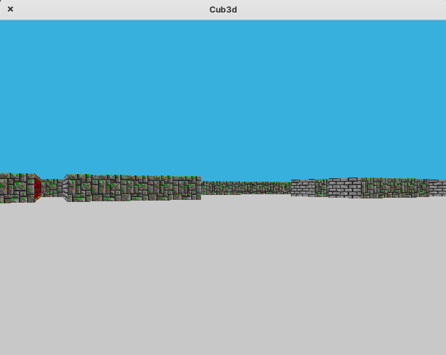

# 🎮 cub3d
A “realistic” 3D graphical representation of the inside of a maze from a first-person perspective.

## 📋 Contents
- [Screenshot]()
- [Getting started]()
- [Makefile commands]()

## 📷 Screenshot

## 🏁 Getting started

## 📝 Makefile commands

`make` compile and generates the libft.a.

`make clean` clean all the .o files from the folder.

`make fclean` executes the make clean command and remove libft.a from the folder.

`make re` executes the make clean and make commands to recompile the library.
